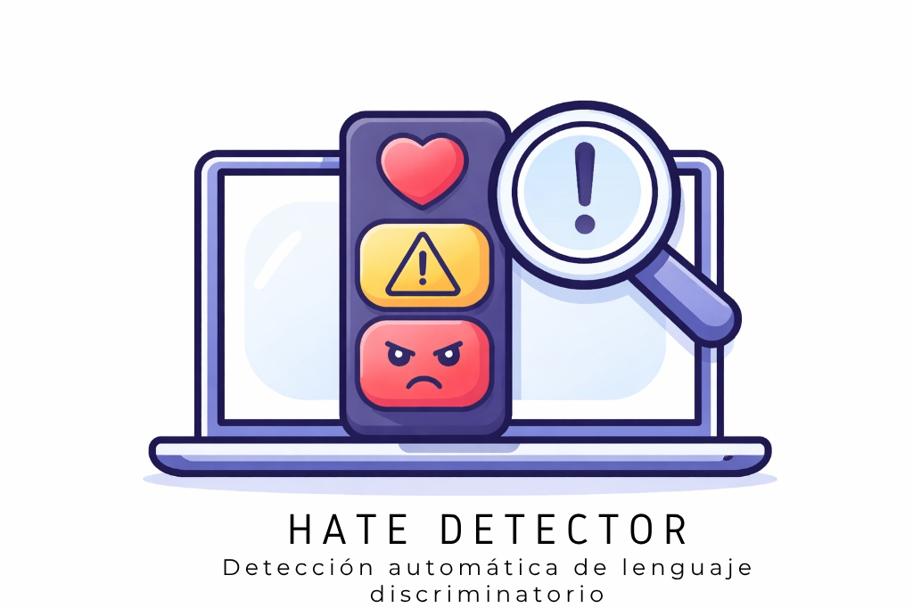

# HATE DETECTOR - v1.0.4 - Extensión para el navegador que apoya en la detección de mensajes discriminatorios en la web.

  

### Motivación
Este proyecto surge de una inquietud personal, impulsada por el deseo de encontrar una herramienta eficaz para identificar y educar sobre el lenguaje de odio en las redes sociales, funcionando como un paragua  que abarcase plataformas web como Instagram, TikTok y YouTube. De esta forma nace Hate Detector como una extensión para los navegadores que pudiese "leer e identificar" todo el texto ofensivo que encontraba durante la nevegación en la web. Por el momento se tiene la versión 1.0.4, que revisa, detecta, registra y permite recibir feedback del usuario para aprender y mejorar la detección. Dispone de 2 modelos, uno para detección de texto discriminatorio en contra de comunidades LGBTQIA+ y otro que amplía el ámbito de acción a la xenofobia, misoginia y bullying en general.

### Guía de Instalación

Este documento contiene las instrucciones para cargar de forma local la extensión "Hate Detector" en tu navegador (está en proceso de revisión), en futuro, una versión mejorada estará disponible en Chrome Web Store de Google.

La idea es que nos apoyes entregando feedback que nos servirá para mejorar la experiencia de usuario.

## NAVEGADORES COMPATIBLES

* Google Chrome
* Brave

## PASOS PARA LA INSTALACIÓN

1. TENER LOS ARCHIVOS NECESARIOS
   * Descarga los archivos de este repositorio y descomprime la carpeta en
     tu equipo.

2. ABRIR LA VENTANA DE EXTENSIONES:
   * Abre tu navegador (Chrome o Brave).
   * En la barra de direcciones, escribe: chrome://extensions
   * Presiona Enter.

3. ACTIVAR EL MODO DESARROLLADOR:
   * Activa el interruptor "Modo desarrollador".

4. CARGAR LA EXTENSIÓN:
   * Haz clic en el botón "Cargar descomprimida".

5. SELECCIONAR LA CARPETA:
   * Selecciona la carpeta del proyecto "Hate Detector" en tu equipo y haz 
     clic en "Seleccionar carpeta".

¡LISTO!

La extensión ya aparecerá en tu lista de extensiones activas. 
